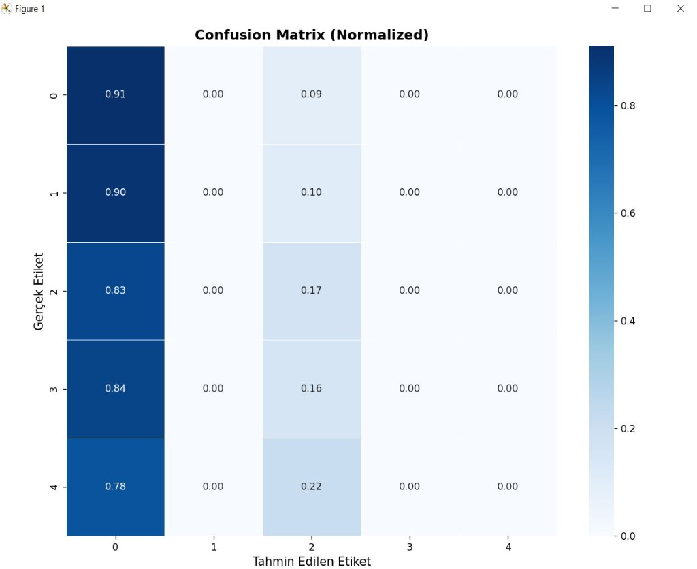
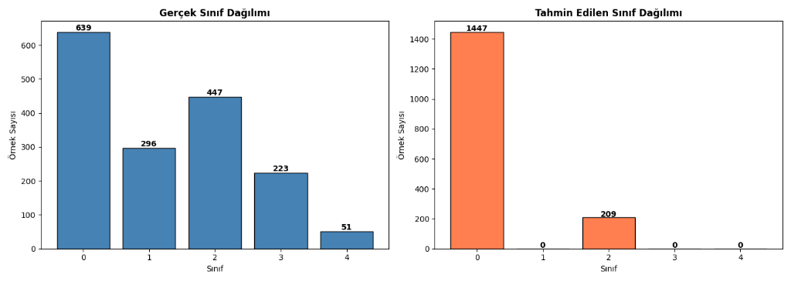
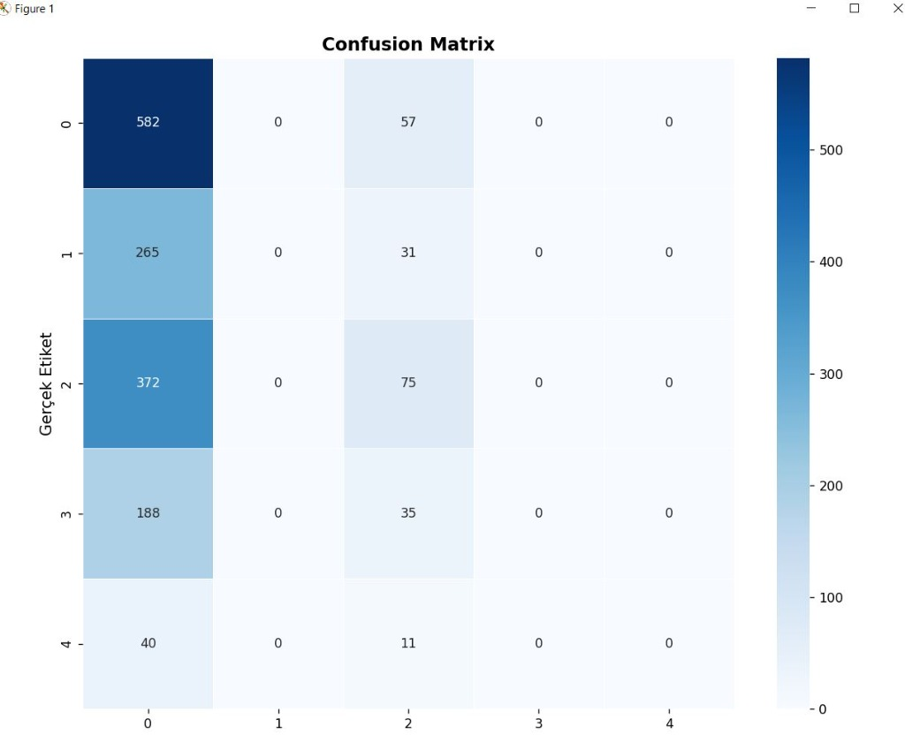

# 🦴 Diz Osteoartrit Sınıflandırması

Diz röntgen görüntülerinden osteoartrit evrelemesi yapan CNN modeli.

---

## 📌 Kısa Özet

| Özellik | Değer |
|---------|-------|
| **Amaç** | Diz röntgenlerini KL skalasına göre sınıflandırma |
| **Sınıf Sayısı** | 5 (Grade 0-4) |
| **Model** | CNN / ResNet18 |
| **Framework** | PyTorch |

---

## 🎯 KL Grade Skalası

| Grade | Durum | Açıklama |
|:-----:|-------|----------|
| 0 | Normal | Osteoartrit yok |
| 1 | Şüpheli | Olası osteofit |
| 2 | Minimal | Kesin osteofit |
| 3 | Orta | Eklem daralması |
| 4 | Şiddetli | İleri düzey |

---

## 📊 Sonuçlar

### Karışıklık Matrisi (Normalized)



### Sınıf Dağılımı



### Karışıklık Matrisi (Sayısal)



---

## 🚀 Hızlı Başlangıç

```bash
# 1. Kurulum
pip install -r requirements.txt

# 2. Veri hazırlama
Expand-Archive -Path archive.zip -DestinationPath data

# 3. Eğitim
python main.py --model cnn --epochs 25

# 4. Değerlendirme
python evaluate_script.py
```

---

## 📁 Proje Yapısı

```
cnnödevi/
├── src/              # Model ve eğitim kodları
├── data/             # Veri seti
├── checkpoints/      # Kayıtlı modeller
├── results/          # Sonuç grafikleri
├── images/           # README görselleri
├── main.py           # Ana script
└── requirements.txt  # Gereksinimler
```

---

## 🛠️ Kullanım Örnekleri

| Senaryo | Komut |
|---------|-------|
| CNN ile eğitim | `python main.py --model cnn --epochs 25` |
| ResNet18 ile eğitim | `python main.py --model resnet18 --pretrained` |
| Sadece test | `python main.py --evaluate --checkpoint checkpoints/best_model.pth` |
| Demo çalıştır | `python demo.py` |

---

## 📋 Gereksinimler

- Python 3.8+
- PyTorch 1.9+
- NumPy, Matplotlib, scikit-learn

---

## 👤 Bilgi

**Ders:** Sinir Ağları  
**Tür:** Bitirme Ödevi  
**Veri Seti:** [Kaggle - Knee Osteoarthritis Dataset](https://www.kaggle.com/datasets/shashwatwork/knee-osteoarthritis-dataset-with-severity)
